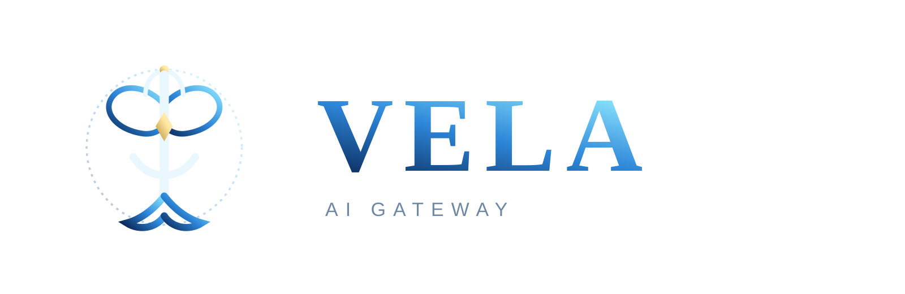

<div align="center">
  

  **一个 OpenAI 兼容端点。40+ 上游供应商。你的订阅、你的密钥、你的免费额度 —— 同一个港湾,同一张帆。**

  Vela(薇拉)将你的 AI 编程工具(Claude Code、Codex、Cursor、Cline、OpenCode……)统一接入一个本地网关,提供格式转换、模型组合回退、多账号轮换、配额追踪,还有一个 RTK token 节省器 —— 在请求出港之前,先削减 20–40% 的工具输出 token。

  [](./CHANGELOG.md)
  [](./docs/PROVIDERS.md)
  [](https://github.com/YumamaX3/Vela/pkgs/container/vela)
  [](https://www.npmjs.com/package/vela)
  [](./LICENSE)

  [🚀 快速开始](#-快速开始) · [✨ 核心特性](#-核心特性) · [📚 文档](#-文档) · [🌐 语言](#-语言)

  🇺🇸 [English](./README.md) · 🇨🇳 [中文](./README.zh-CN.md) · 🇮🇩 [Indonesia](./i18n/README.id-ID.md) · 🇯🇵 [日本語](./i18n/README.ja-JP.md) · 🇻🇳 [Tiếng Việt](./i18n/README.vi.md) · 🇧🇷 [Português](./i18n/README.pt-BR.md) · 🇪🇸 [Español](./i18n/README.es.md) · 🇫🇷 [Français](./i18n/README.fr.md) · 🇷🇺 [Русский](./i18n/README.ru.md) · 🇹🇭 [ไทย](./i18n/README.th.md) · 🇮🇷 [فارسی](./i18n/README.fa_IR.md)
</div>

---

## ⛵ Vela 是什么?

Vela 是一个**本地 AI 路由网关 + 仪表盘**。你把所有 AI 工具指向同一个端点 —— `http://localhost:32060/v1` —— 由 Vela 决定真正应答的是哪家供应商:先花你的付费订阅,再走便宜的 API 通道,最后用免费额度。一条航道干涸,下一条即刻接风。工具端零改动,全程零停机。

```
┌──────────────┐
│  Your tools  │  Claude Code · Codex · Cursor · Cline · OpenCode · …
└──────┬───────┘
       │  http://localhost:32060/v1   (OpenAI-compatible)
       ▼
┌─────────────────────────────────────────────────────┐
│                  Vela — the gateway                  │
│  RTK token saver · format translation · quota track  │
│  combo fallback · multi-account · OAuth refresh      │
└──────┬──────────────────────────────────────────────┘
       ├─→ Tier 1  SUBSCRIPTION   Claude, Codex, Copilot, Cursor…
       ├─→ Tier 2  PAY-PER-USE    GLM, MiniMax, DeepSeek, Qwen…
       └─→ Tier 3  FREE           Kiro, OpenCode Free, MiMo Free…

       Result: every subscription token spent, every rate limit routed around.
```

内里乾坤:一个运行在 **32060** 端口上的 Next.js 服务(仪表盘 + API),一个与供应商解耦的路由引擎(`open-sse/`),以及一个 SQLite 数据库 —— 需要时它可以长出一个 MariaDB 孪生库(sqlite → mysql → mirror)。

> 📌 **注意:** Vela 自成航路 —— 一片开源水域锻造的 AI 网关,存储、备份、定价与分类体系皆为自铸。CLI 以 `vela` 之名从 npm 安装。

---

## 🤔 为什么选择 Vela?

| 痛点 | Vela 的对策 |
|-|-|
| ❌ 订阅额度过期也用不完 | ✅ 配额追踪 + 自动回退 —— 在重置之前花光每一个 token |
| ❌ 速率限制让心流戛然而止 | ✅ 多账号轮换 + 模型组合回退,零停机 |
| ❌ 工具输出疯狂烧 token(diff、grep、ls……) | ✅ **RTK token 节省器**原地压缩 `tool_result` 内容 —— 节省 20–40% |
| ❌ 每家供应商每月要花 $20–50 | ✅ 一个网关横跨订阅 + 低价 + 免费三条航道 |
| ❌ 每个工具都要单独配置 | ✅ 一个 OpenAI 兼容端点,所有工具都认它 |

---

## ✨ 核心特性

**🧭 路由与转换**
- 一个 OpenAI 兼容端点:`/v1/chat/completions`、`/v1/messages`(Claude 原生)、`/v1/embeddings`、`/v1/images/generations`、`/v1/audio/*`、`/v1/responses`、`/v1/videos/*`、web search 与 fetch
- 格式转换以 OpenAI 作为中间格式枢轴 —— 为脆弱的格式对(thinking block、工具 id)注册了直达路由
- 注册了 **129 家供应商**:OpenAI、Anthropic、Google Gemini、xAI、DeepSeek、Qwen、GLM、MiniMax、Kimi、Mistral、Groq、Cerebras、Vertex、Azure、Ollama,还有数十家 —— [完整名录](./docs/PROVIDERS.md)

**🪂 韧性**
- 模型组合回退:定义一个组合,Vela 沿列表逐一尝试,直到有供应商应答
- 每家供应商支持多账号回退,轮换(round-robin)
- OAuth + API 密钥凭据管理,自动刷新 token

**💰 成本智能 —— 定价契约**
- 静态价格表(input / output / cached / reasoning / cache-creation,$/1M tokens),配六步解析链 —— 供应商覆盖、精确匹配、免费模型继承、去厂商前缀、glob 兜底
- 仪表盘价格编辑器 + models.dev 同步 —— 每个请求都有诚实的估算成本
- 免费额度识别:免费模型继承其付费兄弟的价格,让节省看得见

**🐚 RTK Token 节省器**
- 预转换钩子在请求出港前压缩 `tool_result` 内容 —— 设计上失败即放行(fail-open),从不触碰 `is_error` 痕迹
- 可选 [Headroom](https://github.com/chopratejas/headroom) 边车(sidecar),做更深层压缩

**🗝️ 存储契约**
- 三种姿态,一个环境变量:`VELA_DB_MODE=sqlite|mysql|mirror`
- 默认 SQLite 港湾;MariaDB 可作完整港湾;或者 **mirror** —— SQLite 对外服务,每次写入都泵入 MariaDB 孪生库,由分歧巡检护航
- 密封备份引擎:AES-256-GCM 备份产物、保留分级、演练 + 恢复、可选 S3 异地腿

**🖥️ 仪表盘** —— `http://localhost:32060/dashboard`
- 供应商与 OAuth 流程、组合、端点 + API 密钥、按密钥用量、配额、token 节省器、翻译器控制台、CLI 工具配置页、定价设置 —— 支持 34+ 种界面语言

---

## 🚀 快速开始

### 方案 A —— Docker(推荐)

```bash
docker login ghcr.io          # PAT with read:packages — the image is private
docker pull ghcr.io/yumamax3/vela:0.6.70

docker run -d --name vela \
  -p 32060:32060 \
  -v "$HOME/vela-data:/app/data" \
  -e DATA_DIR=/app/data \
  -e JWT_SECRET="$(openssl rand -hex 32)" \
  -e INITIAL_PASSWORD="change-me" \
  ghcr.io/yumamax3/vela:0.6.70
```

完整海图 —— MariaDB 孪生库、mirror 姿态、备份引擎、Headroom 边车 —— 见 [DOCKER.md](./DOCKER.md) 与 [`docker-compose.example.yml`](./docker-compose.example.yml) 模板。

### 方案 B —— npm CLI

```bash
npm install -g vela
vela
```

CLI 负责安装、启动并管理服务器(启动器包在 npm 上保留 `vela` 之名)。

### 方案 C —— 从源码运行

```bash
git clone <this repo> && cd Vela
cp .env.example .env
npm install
PORT=32060 NEXT_PUBLIC_BASE_URL=http://localhost:32060 npm run dev
```

生产环境:`npm run build && PORT=32060 HOSTNAME=0.0.0.0 npm run start`

### 然后接入你的工具

1. 打开 `http://localhost:32060/dashboard`(默认密码 `123456` —— 请修改)
2. **Providers** → 连接一家(Kiro AI 是个不错的免费起点)
3. **Endpoints** → 复制一个 API 密钥
4. 把你的工具指向网关:

```
Endpoint: http://localhost:32060/v1
API Key:  <from dashboard>
Model:    kr/claude-sonnet-4.5      # provider prefix / model name
```

---

## 📚 文档

海图都存放在 [`docs/`](./docs/README.md) —— 一张完整的港湾地图。

| 海图 | 内容 |
|-|-|
| [docs/README.md](./docs/README.md) | 🧭 港湾地图 —— 所有文档,一页尽览 |
| [docs/ARCHITECTURE.md](./docs/ARCHITECTURE.md) | 🏗️ 请求生命周期、翻译器引擎、供应商注册表、数据库层 |
| [docs/DEPLOYMENT.md](./docs/DEPLOYMENT.md) | 🚀 安装路径、compose 海图、存储姿态、升级 |
| [docs/ENVIRONMENT.md](./docs/ENVIRONMENT.md) | 🔧 完整的环境变量契约 |
| [docs/STORAGE.md](./docs/STORAGE.md) | 🗝️ 存储契约 —— sqlite/mysql/mirror、备份、S3 |
| [docs/PROVIDERS.md](./docs/PROVIDERS.md) | 🌐 129 家供应商完整名录 |
| [docs/API.md](./docs/API.md) | 🔌 OpenAI 兼容面 + 仪表盘 API |
| [docs/TROUBLESHOOTING.md](./docs/TROUBLESHOOTING.md) | 🧯 当风停的时候 |
| [docs/VERSIONING.md](./docs/VERSIONING.md) | ⛵ 版本契约 |
| [DOCKER.md](./DOCKER.md) | 🐳 Docker 深潜 |
| [CHANGELOG.md](./CHANGELOG.md) | 📖 航海日志 |

**在本仓库工作的工程师:** [CLAUDE.md](./CLAUDE.md) —— 船员文书。
**引擎贡献者:** [open-sse/AGENTS.md](./open-sse/AGENTS.md) —— 如何添加供应商 / 执行器 / 翻译器。

---

## 🗺️ 仓库结构

```
src/                 Next.js app — dashboard UI + /api routes (incl. /v1)
├── app/             pages + API route handlers
├── sse/handlers/    app-side entry glue (chat, tts, images, search…)
└── lib/db/          SQLite/MariaDB layer — driver chain, repos, mirror, backups

open-sse/            the provider-agnostic routing/translation engine
├── handlers/        chatCore, embeddings, tts, images, video, search
├── executors/       per-provider upstream call (29 specialized + default)
├── translator/      format translation via OpenAI pivot
├── providers/       registry (129 files) + pricing covenant
└── rtk/             token saver hooks (fail-open)

cli/                 the launcher package (npm: vela)
docs/                the charts — start at docs/README.md
plans/               sealed design plans (Storage Covenant, Pricing Covenant…)
tests/               vitest suite (independent ESM package)
i18n/                localized READMEs (10 languages)
```

---

## 🌍 语言

本 README 还被翻译成了另外 10 种语言 —— 链接见顶部横幅。仪表盘本身内置 34+ 种界面语言;可在仪表盘的个人资料页切换。

---

## 🏛️ 起源与许可

Vela 自 v0.6.0 起扬帆独行 —— 网关以 MIT 许可发布,完全自铸。见 [LICENSE](./LICENSE)。

---

<div align="center">

*扬起你的帆。风是免费的。* ⛵

</div>
