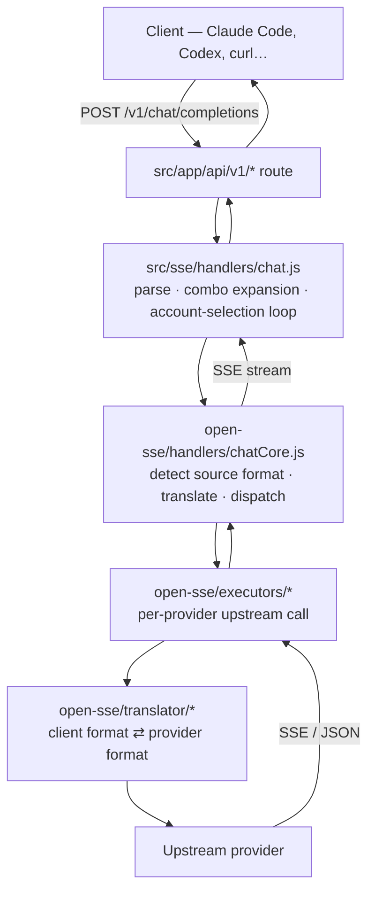

# 🏗️ Vela Architecture

> *"Follow one request from the harbor gate to the open sea — and every deck
> it crosses on the way. This chart covers the request lifecycle, the
> translator engine, the provider registry, the database layer, and the
> systems that keep the ship afloat."*

**Covers:** request lifecycle · translator engine · provider registry ·
executors · combos & fallback · RTK token saver · database layer · storage
postures · backup engine · pricing covenant · security boundaries.

---

## Table of Contents

- [The Shape of the Ship](#-the-shape-of-the-ship)
- [Request Lifecycle](#-request-lifecycle)
- [The Translator Engine](#-the-translator-engine)
- [The Provider Registry](#-the-provider-registry)
- [Executors](#-executors)
- [Combos & Fallback](#-combos--fallback)
- [The RTK Token Saver](#-the-rtk-token-saver)
- [The Database Layer](#-the-database-layer)
- [Storage Postures & The Mirror](#-storage-postures--the-mirror)
- [The Backup Engine](#-the-backup-engine)
- [The Pricing Covenant](#-the-pricing-covenant)
- [Authentication & Security](#-authentication--security)
- [Directory Map](#-directory-map)

---

## 🗺️ The Shape of the Ship

Vela is one Node.js process with three concerns:

| Layer | Where | What it does |
|-|-|-|
| **Dashboard + API** | `src/` (Next.js app) | Web UI, REST APIs, auth, settings — and the `/v1/*` gateway entry (a rewrite maps `/v1/*` → `/api/v1/*` in `next.config.mjs`) |
| **Routing engine** | `open-sse/` | Provider-agnostic translation + dispatch. Usable standalone; the app consumes it through thin glue |
| **Persistence** | `src/lib/db/` | SQLite by default, MariaDB twin or full harbor on demand, sealed backups |

The boundary between `src/sse/` (app-side entry glue) and `open-sse/` (the
engine) is deliberate. Cross it consciously.

---

## 🔄 Request Lifecycle

A chat completion is the canonical voyage:



Step by step:

1. **Entry** — `src/app/api/v1/chat/completions/route.js` receives the
   request. The model string may be plain (`gpt-5`) or prefixed
   (`kr/claude-sonnet-4.5`) — the prefix names the provider lane.
2. **Combo expansion** — if the model is a *combo*, `src/sse/handlers/chat.js`
   expands it into its ordered model list. The handler then runs the
   account-selection loop: for each candidate model, pick the account to try.
3. **Core dispatch** — `open-sse/handlers/chatCore.js` detects the incoming
   format (OpenAI / Claude-native), translates the request, dispatches to the
   executor, and owns retry + token-refresh on 401/expired credentials.
4. **Execution** — the executor makes the upstream call. `default.js` handles
   any OpenAI-compatible provider; specialized executors speak binary or
   bespoke protocols (see [Executors](#-executors)).
5. **Response** — streamed SSE (or JSON) flows back through the translator,
   which rewrites it into the client's format. Usage accounting records
   tokens + estimated cost on the way out.

Other surfaces share the same bones: `embeddings`, `audio/*` (tts/stt),
`images/generations`, `videos/*`, `responses`, `search`, and `web/fetch`
each have a handler in `src/sse/handlers/` paired with a core in
`open-sse/handlers/`.

---

## 🈳 The Translator Engine

`open-sse/translator/` converts between wire formats by pivoting through
**OpenAI as the intermediate format**:

```
Claude request → OpenAI intermediate → provider format
provider response → OpenAI intermediate → Claude response
```

Three laws govern the engine:

1. **Direct routes skip the pivot.** A translator registered on an exact
   `source:target` pair (e.g. `claude:kiro`) runs as a direct route,
   avoiding the lossy double-hop. Prefer a direct route for fragile pairs —
   thinking blocks, tool ids, non-base64 images, `is_error` flags.
2. **Translators self-register** via `register(from, to, reqFn, resFn)` as
   an import side effect. ⚠️ A new translator file MUST be imported in
   `open-sse/translator/index.js` or it never runs.
3. **Nothing hardcoded.** Roles, block types, and model strings come from
   `open-sse/translator/schema/` and `open-sse/config/` constants.
   Config-driven and DRY is enforced by convention here.

---

## 🌐 The Provider Registry

`open-sse/providers/registry/` — **one file per provider, 129 files**.

- `registry/index.js` is an **auto-generated** static import list.
  Regenerate with `scripts/migrate-registry.mjs` /
  `injectDisplayToRegistry.mjs` — never hand-edit.
- Adding a provider: copy `open-sse/providers/REGISTRY_TEMPLATE.js`, add its
  models to `open-sse/config/providerModels.js`, and (only if the upstream is
  NOT OpenAI-compatible) add an executor.
- Each registry file declares: id, aliases, auth style, endpoints, models,
  and display metadata. Aliases matter — they key the pricing overrides and
  the `provider/model` addressing.

---

## ⚙️ Executors

`open-sse/executors/` — the per-provider upstream call layer.

- **`default.js`** handles any OpenAI-compatible provider. Most providers
  never need anything else.
- **Specialized executors** exist where the upstream speaks a non-OpenAI
  protocol: `azure.js`, `vertex.js`, `codex.js`, `cursor.js`, `kiro.js`,
  `gemini-cli.js`, `grok-web.js`, `perplexity-web.js`, `ollama-local.js`,
  and more (~29 total).
- ⚠️ Binary/protobuf upstreams (Kiro EventStream, Cursor protobuf,
  CommandCode NDJSON) **do not round-trip through the translator** — they are
  handled inside their own executor.

---

## 🪂 Combos & Fallback

Two fallback mechanisms, applied in order by the account-selection loop in
`src/sse/handlers/chat.js`:

| Mechanism | What it does |
|-|-|
| **Model combos** | A combo is an ordered list of models. Vela tries them in sequence until one succeeds — subscription → cheap → free is the classic shape |
| **Multi-account fallback** | Several credential sets per provider; round-robin rotation spreads load and routes around per-account rate limits |

When an executor reports an auth failure, `chatCore.js` attempts a token
refresh before falling back. Quota exhaustion moves the loop to the next
candidate.

---

## 🐚 The RTK Token Saver

`open-sse/rtk/` — pre-translate hooks that compress `tool_result` content
in-place, cutting the tokens that tool output (diffs, grep results, file
listings) burns before the request even leaves.

Two invariants:

- **Fail-open.** Any error returns `null` and leaves the body untouched —
  the hooks never throw.
- **Traces preserved.** Results flagged `is_error` / `status: "error"` are
  skipped so debugging traces survive intact.

The optional **Headroom** sidecar (separate Python service,
`HEADROOM_URL`) provides deeper request compression; it never ships inside
the Vela image — see [DOCKER.md](../DOCKER.md).

---

## 🗄️ The Database Layer

State lives in SQLite — **not** `db.json` (that era is over). The layer sits
under `src/lib/db/`:

**Driver chain** (`driver.js`) — first that loads wins:
`bun:sqlite` → `better-sqlite3` (optional native dep) → `node:sqlite`
(Node ≥ 22.5) → `sql.js` (pure-JS fallback, always works).
`better-sqlite3` sits in `optionalDependencies` so install never fails
without build tools.

**Facades** — `src/lib/db/repos/*.js` are path-stable entry points. Each
facade binds by posture: sqlite re-exports its harbor verbatim; mysql binds
the `repos/mysql/` twin. `src/lib/localDb.js` is a backward-compat shim —
new code imports `@/lib/db/index.js`.

**Schema** — `src/lib/db/migrations/` runs seven migrations
(`001-initial` → `007-mirror-seq`); `SCHEMA_VERSION = 7`. Usage/logs
(`src/lib/usageDb.js`) still live under `~/.vela` and do **not** follow
`DATA_DIR`.

**DB file location** — `src/lib/db/paths.js`: `DATA_DIR` if set, else
`~/.vela/`.

---

## 🪞 Storage Postures & The Mirror

`VELA_DB_MODE` selects the harbor:

| Posture | Behavior |
|-|-|
| `sqlite` | Single-store, exactly today. The default |
| `mysql` | MariaDB IS the harbor. An unreachable twin refuses boot **LOUD** — never silent |
| `mirror` | SQLite PRIMARY serves every read/write; writes mirror to the MariaDB twin through the outbox pump |

The mirror's machinery (Storage Covenant, waves C1–C5):

```
write → outbox capture (decorator) → pump → MariaDB twin
                                  ↘ poison policy after retry budget
divergence sweep (interval) → threshold breach → full resync
usage rows → watermark resync (separate rhythm, batched)
```

A down twin **degrades** the mirror — it never silently downgrades the mode.
All tuning knobs are documented in [ENVIRONMENT.md](./ENVIRONMENT.md).

---

## 🗝️ The Backup Engine

Opt-in (`VELA_BACKUP_ENABLED=true`), sealed with AES-256-GCM:

- Scheduled artifacts with retention tiers (daily + weekly)
- Restore flow + restore **drill** (`/api/backup/drill`) — rehearse before you need it
- Optional S3 off-site leg (SigV4, dependency-free)
- ⚠️ `VELA_BACKUP_ENCRYPTION_KEY` loss = permanently unrecoverable backups

The purge (`VELA_USAGE_RETENTION_DAYS`) runs AFTER the scheduled backup so
purged rows live in the artifact. Full detail: [STORAGE.md](./STORAGE.md).

---

## 💰 The Pricing Covenant

Estimated cost per request, resolved through a static chain in
`open-sse/providers/pricing.js` (first match wins):

1. `UNPRICEABLE` manifest — router pseudo-models resolve `null` + reason
2. `PROVIDER_PRICING[id|alias][model]` — provider-lane overrides
3. `MODEL_PRICING[model]` — canonical exact match
4. `FREE_ALIAS_MAP[model]` — free models inherit the paid sibling's exact
   rate (guarded suffix-strip fallback; denylist blocks router traps)
5. `MODEL_PRICING[stripVendor(model)]` — vendor-prefix stripped
6. `PATTERN_PRICING` — pre-compiled globs, last resort

Async layers sit above the chain: user overrides (scope `pricing`) and
models.dev sync (scope `pricing_sync`) in `src/lib/db/repos/pricingRepo.js`.
A model that matches nothing resolves `null` → est. cost shows $0. Add its
rate or a pattern to fix.

---

## 🔐 Authentication & Security

- **Session** — JWT cookie (`JWT_SECRET`). The Vela session cookie name is
  separate from upstream (pre-Vela).
- **First login** — `INITIAL_PASSWORD` (default `123456`; change it).
  SSO paths exist: OIDC and SAML routes under `/api/auth/*`.
- **API keys** — per-endpoint keys hashed with `API_KEY_SECRET`; machine id
  salted with `MACHINE_ID_SALT`.
- **Client IP** — `custom-server.js` wraps the Next standalone server to
  derive the client IP from the **TCP socket** and strips attacker-controlled
  `X-Forwarded-For`, trusting forwarding headers only from a loopback reverse
  proxy. Preserve this when touching request/IP/rate-limit code.
- **Backup routes** are always auth-protected; settings redaction masks
  secret keys in API responses (see STORAGE.md).

---

## 🗂️ Directory Map

```
src/
├── app/                 Next.js app — dashboard pages + API routes
│   ├── (dashboard)/     dashboard UI pages
│   └── api/             REST APIs — auth, backup, combos, keys, models,
│                        oauth, pricing, providers, settings, usage, v1/*
├── sse/handlers/        app-side entry glue for the engine
└── lib/
    ├── db/              driver chain, adapters, migrations, mirror
    │   └── repos/       facades + sqlite/mysql implementations
    └── usageDb.js       usage + request logs (~/.vela)

open-sse/
├── handlers/            chatCore, embeddingsCore, ttsCore, imageCore, …
├── executors/           per-provider upstream calls (~29)
├── translator/          format translation (OpenAI pivot + direct routes)
├── providers/           registry (129) + pricing.js + REGISTRY_TEMPLATE.js
├── rtk/                 token saver hooks
├── config/              providerModels + shared constants
└── AGENTS.md            ← engine contributor guide

cli/                     launcher package (npm: vela)
docs/                    these charts
plans/                   sealed design plans (ADR-style)
tests/                   vitest suite — independent ESM package
```

---

## 🔗 See Also

- [STORAGE.md](./STORAGE.md) — the Storage Covenant in full
- [API.md](./API.md) — the endpoint surface
- [PROVIDERS.md](./PROVIDERS.md) — the provider roster
- [open-sse/AGENTS.md](../open-sse/AGENTS.md) — how to add a provider / executor / translator
- [../CLAUDE.md](../CLAUDE.md) — the crew's papers

— *Vela · The Sail of the Ship* ⛵
